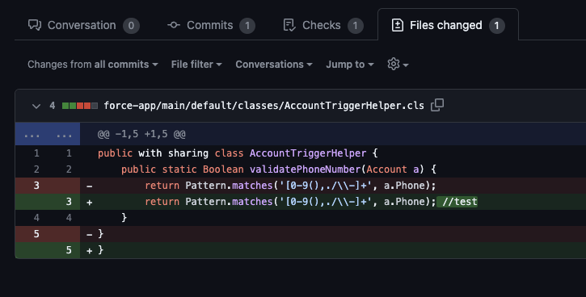
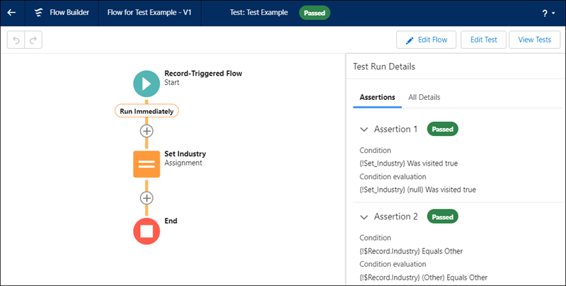

+++
title = 'Why you should use Apex instead of Flows in Salesforce'
date = 2024-03-12T12:34:07-04:00
draft = false
categories = ['salesforce', 'apex', 'flows']
keywords = ['kyle capehart', 'salesforce', 'apex', 'apex class', 'apex trigger', 'flows', 'record triggered flow', 'lightning flow', 'declarative', 'programmatic', 'apex vs flows', 'triggers vs flows', 'salesforce flow tests', 'testing flows with apex', 'salesforce version control', 'declarative tests', 'Should I use flows or apex', 'how to test flows', 'asynchronous with flow', 'batch process in flows or apex trigger']
+++

Programmatic vs declarative solutions.

## Apex vs Flows
It's all been said before. Flows are the powerful, simple, declarative solution to automation in Salesforce that are getting better with every release.

But are they the **right** solution?

In most trainings, Flows are recommended as the go-to Salesforce tool, with Apex only used if the logic becomes too complex. Salesforce has even doubled down on their commitment to declarative tools by unveiling their new character, [Flo the Flying Squirrel](https://www.salesforce.com/blog/meet-salesforce-workflow-character-flo/). 

However, flows were never meant to replace Apex entirely. They are simply an alternative solution to problems commonly solved using Apex triggers. There *are* times when Flows are a viable option, like if there isn’t a developer on hand who can write code. That being said, any software solution needs to be able to scale. For a company hoping to provide a smooth CRM transition, Salesforce implementations need to be designed by engineers from the start. Otherwise, it's being set up for failure. 

## The Case for Apex
Engineers need to be allowed to engineer. This means using the best tools available, and Apex provides that. The reasoning is as follows.

### Handling Complex Logic
A small sales organization does not need much customization in Salesforce right away. Simple problems are easily solved by point-and-click tools. However, as time goes on and the organization grows, complexity compounds. Suddenly Salesforce needs to communicate with numerous external systems, process large batches of records, and perform complex SOQL queries, all of which Flows struggle to deliver.

Take this example. There is a requirement to update a field on all child account records whenever a parent record is updated. A flow is created to satisfy this, which works at first. However, a few months later someone notices the flow occasionally fails. When a developer investigates, they discover a governor limit being hit when updating Accounts with thousands of child records. After spending time debugging, the logic is eventually moved to an Apex trigger which calls a helper class implementing the `Database.Batchable` interface.

Record updates like the example above should always be designed to handle bulk operations, best handled in Apex. Flows are often touted as easier to build, which is certainly true if you’re not a developer, but otherwise not necessarily. Valuable time can be wasted during a sprint trying to get a flow to handle a complex operation, only to eventually be abandoned and have the processing handled in an invocable Apex action. This extra development time can be avoided if the solution is designed in Apex from the start.

### Ease of Maintenance
If too many processes are built in flows, then it quickly becomes difficult to maintain. Over time, flows might end up looking like this, which become a nightmare to debug:

As mentioned before, it might become necessary to move complex functionality from flows into code. If there are Apex triggers and record-triggered flows, then the order of execution needs to be considered to ensure expected outcomes still hold. With an absence of clear documentation, it can be cumbersome to figure out where certain business logic resides.

If a field is referenced in a deactivated flow version, it prevents deletion of the field, requiring old flow versions to be removed. This can prevent much needed refactoring, especially if an object is approaching the field limit. It’s also very tedious to move elements from one flow to another in the event anything needs to be reorganized.

Apex classes are easily designed to be reusable without significant development overhead. Refactoring code can be as simple as copying and pasting methods from a trigger into a helper class, so developers never have to waste time manually rewriting logic. Interfaces and abstract classes can be utilized to design well organized frameworks so that updates are always easy to make.

### Tracking Changes
Version control is essential for any engineering team, Salesforce teams included. Flows have a versioning system, but it can be hard to determine exactly what has changed between each version. Luckily, flow metadata can be checked into a git repository and tracked from there.

What’s the problem then?

The metadata is in XML, and not human readable. The only viable way to perform a code review on a flow is to open it in a sandbox and view it in the UI. This isn’t feasible if it was developed in a scratch org, meaning the reviewer will have to deploy it to their own environment. This extra step causes unneeded delays in development.

Apex offers a clear advantage due to its readability.

Tracking code in a git based repository is the industry standard, and is the best way to determine exactly what has changed between releases. Each modified line in an Apex class or trigger can easily be read by a reviewer and approved without any need of logging in to Salesforce. It is also a very familiar process for experienced software engineers.

### Writing Tests
Flows offer almost the same power as Apex but with a simpler learning curve, which is usually considered a positive. There’s a huge problem with this reasoning though. Apex code requires a minimum threshold of code coverage before deploying to production. Flows by default, do not.

If a tool can make external callouts to systems, reassign records, expose data, or any other number of high impact operations, there needs to be a certain level of security. Not to mention the reliability of a system that doesn't have standardized tests in place. [Declarative flow tests](https://help.salesforce.com/s/articleView?id=sf.flow_concepts_testing.htm&type=5) have recently been released, but they don’t replace the full functionality of Apex test classes. Most importantly, they're missing the ability to automatically run during a deployment. This is essential in any CI/CD process to ensure breaking changes are caught.

There is a way to [enforce flow test coverage](https://help.salesforce.com/s/articleView?id=release-notes.rn_forcecom_flow_mgmnt_coverage.htm&release=222&type=5) from Apex tests, which is highly recommended for any organization using flows. However, the fact that it’s not enabled by default is a big concern. Salesforce themselves recommend a [test-driven development process](https://developer.salesforce.com/docs/atlas.en-us.apexcode.meta/apexcode/apex_testing_intro.htm), which is best done through Apex tests to ensure they are created early on.

Currently there is no way to test asynchronous paths in flows, so it is hard to justify the use of them if automated tests can't be created. Vote on this much needed feature in the [Salesforce IdeaExchange](https://ideas.salesforce.com/s/idea/a0B8W00000QO3yoUAD/allow-testing-of-asynchronous-path-in-flow-via-apex).

Apex tests are flexible and easily written. They allow the ability to write bite-sized unit tests and create standardized data sets exclusively used for testing. Automated tests should always be used to reduce risk when new features are released. These test classes can be the difference between a successful launch and a catastrophic one.

## Conclusion
Flows have their place in the Salesforce ecosystem, but when it comes to picking the right tool for the job, Apex comes out on top almost every time. Invest in developers early on and Salesforce is less likely to become bloated with poorly optimized solutions. Software engineering teams should be encouraged to embrace code rather than avoid it.

 *Comments or questions? <a href="mailto: kyleacapehart@gmail.com">Send me a message</a>*
