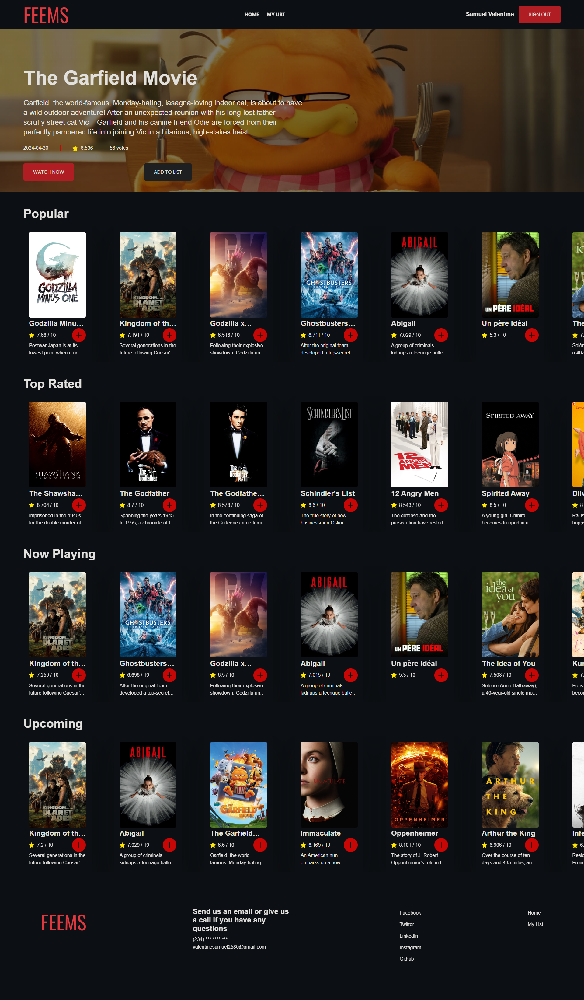

+++
title = 'Feemflix'
date = 2022-04-02T10:38:35-04:00
draft = false
categories = ['react', 'redux', 'firebase', 'api', 'javascript', 'web-development',
'front-end-projects']
keywords = [
  'Valentine Samuel',
  'React movie app',
  'Redux movie search',
  'Movie details viewer',
  'User preferences',
  'Movie database',
  'Web development',
  'Front-end projects',
  'JavaScript',
  'Responsive design',
  'Movie recommendations',
  'Firebase authentication',
  'Redux state management',
  'API integration',
  'React Router',
  'Styled Conponent',
  'SCSS',
  'User authentication',
  'User registration',
  'User login',
  'User account',
  'Movie search engine',
]
+++

Feemflix is a web application built using React JS and Redux, its primary purpose is to allow users to search for movies, view movie details, and manage their preferences. The app fetches movie data from an external API (such as The Movie Database) and displays detailed information about each movie, including the title, release date, cast, plot summary, ratings, and more. Users can create an account or log in to save their favorite movies and access personalized features. The app is designed to work seamlessly on both desktop and mobile devices, with responsive layouts and user-friendly navigation. User data is stored securely and managed using Redux and Firebase, ensuring a smooth and secure experience for all users.

# Redux Movie App

The **Redux Movie App** is a web application built using **React JS** and **Redux**. Its primary purpose is to allow users to search for movies, view movie details, and manage their preferences. Let's dive into the details:

## Features:

1. **Movie Search:**

   - Users can search for movies by title, genre, or other criteria.
   - The app fetches movie data from an external API (such as **The Movie Database**).

2. **Movie Details:**

   - When a user selects a movie from the search results, they can view detailed information about that movie.
   - Details include the movie's title, release date, cast, plot summary, ratings, and more.

3. **User Preferences:**

   - Users can create an account or log in to save their favorite movies.
   - The app uses Redux to manage user state and preferences.

4. **Responsive Design:**

   - The app is designed to work seamlessly on both desktop and mobile devices.
   - CSS frameworks like **Bootstrap** or custom styling are used for responsive layouts.

5. **Authentication:**
   - Users can create an account or log in to access personalized features. THey can signin with github, email or gmail.
   - User data is stored securely and managed using Redux and firebase.

## Components:

1. **Search Component:**

   - Handles user input for movie search.
   - Sends search queries to the API and displays results.

2. **Movie Details Component:**

   - Displays detailed information about a selected movie.
   - Includes movie poster, title, release date, cast, and other relevant data.

3. **User Authentication Component:**

   - Manages user login and registration.
   - Stores user preferences using Redux.

4. **Redux Store:**
   - Contains the global state for the app.
   - Stores user data, search results, and other relevant information.

## Technologies Used:

- **React JS**: Front-end library for building user interfaces.
- **Redux**: State management library for managing app-wide state.
- **API Integration**: Fetches movie data from external APIs.
- **CSS/SCSS**: Styling and layout.
- **React Router**: Handles navigation between different views.

## Getting Started:

1. Clone the repository: `git clone https://github.com/valentinesamuel/redux-movie-app.git`
2. Install dependencies: `npm install`
3. Start the development server: `npm start`

Feel free to explore the codebase and enhance the app further! 🎬🍿

 _Comments or questions? <a href="mailto: kyleacapehart@gmail.com">Send me a message</a>_
